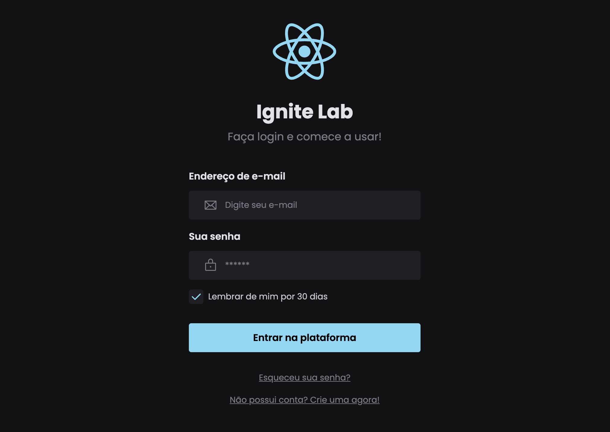

<h1 align="center"> Explorer Lab - Design System </h1>

Evento promovido pela Rocketseat onde codificamos um formulário usando um Design Sytem.

  <a href="#-tecnologias">Tecnologias</a>&nbsp;&nbsp;&nbsp;|&nbsp;&nbsp;&nbsp;
  <a href="#-projeto">Projeto</a>&nbsp;&nbsp;&nbsp;|&nbsp;&nbsp;&nbsp;
  <a href="#-layout">Layout</a>&nbsp;&nbsp;&nbsp;|&nbsp;&nbsp;&nbsp;
  <a href="#memo-licença">Licença</a>

  

 

  

## 🚀 Tecnologias

Esse projeto foi desenvolvido com as seguintes tecnologias:

- HTML e CSS
- JavaScript e JSON
- [React] (https://pt-br.reactjs.org/)
- [Node e NPM](https://nodejs.org/)
- [Figma] (https://figma.com)
- [Tailwind css] (https://tailwindcss.com/)
- [Vite](https://vitejs.dev/)
- [Storybook](https://storybook.js.org/)
- [Radix] (https://www.radix-ui.com/)

## 💻 Projeto

Projeto desenvolvido durante o Explorer Lab 3 da Rocketseat, onde pude ter contato com várias ferramentas para a construção de um Design System como: Figma, React, StoryBook e TailwindCSS.

## 🔖 Layout

Você pode visualizar o layout do projeto através [DESSE LINK](https://www.figma.com/file/xZGqsyYiaXiqA3Vg07AfQw/Ignite-Lab?node-id=2%3A56). É necessário ter conta no [Figma](https://figma.com) para acessá-lo.

## :memo: Licença

Esse projeto está sob a licença MIT.

---

Feito por Bruno Rodrigues feat Rockeseat
